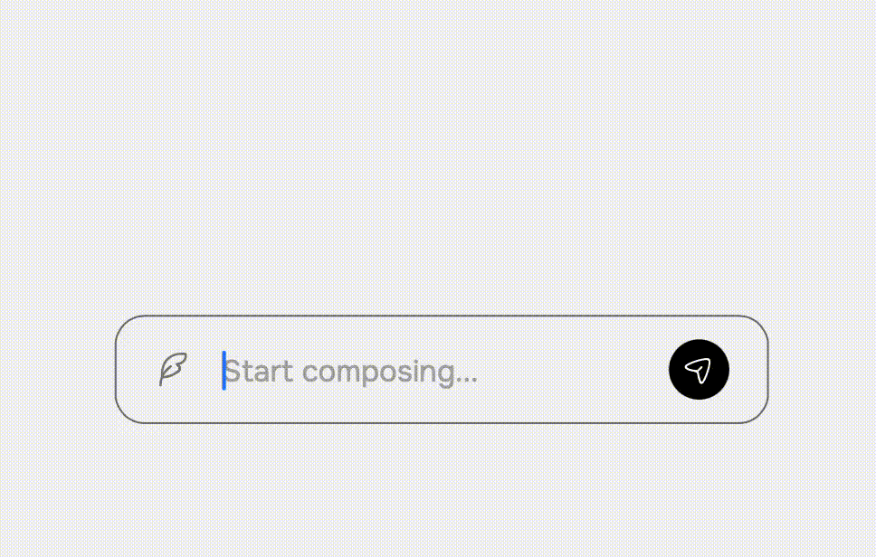

# Smart Compose UI

## Overview

Smart Compose UI is a Vue.js-based component that provides an 'intelligent' message composition interface with dynamic suggestions for location and picture attachments. The concept behind was to create a functional user interface with cool animations. It uses Vue as a CDN.

## Features

- Location suggestion detection
- Picture suggestion based on contextual keywords
- Animated UI interactions using GSAP (GreenSock Animation Platform)

## How It Works

### Smart Compose Functionality

The application analyzes user input in real-time and provides context-aware suggestions:

- **Location Suggestions**: Detects location mentions in the text (e.g., "meet at [location]?")
- **Picture Suggestions**: Triggers when keywords like "great time", "today", or "with" are used

### UI Animations

Suggestions appear and disappear with smooth GSAP animations, creating a dynamic user experience.

## Future Improvements

- Add more sophisticated input analysis
- Expand suggestion types
- Add more comprehensive error handling

## Demo
